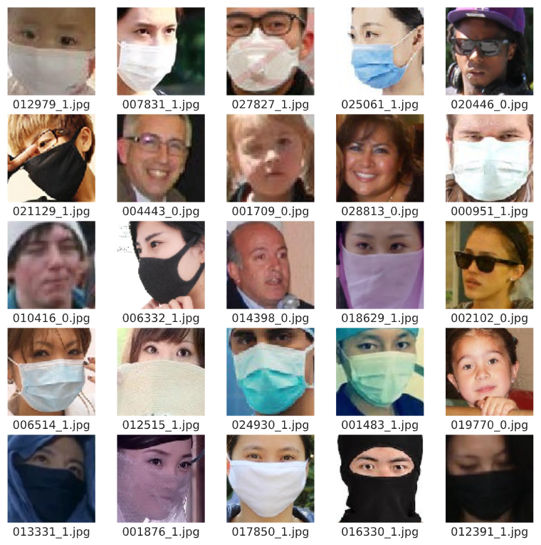
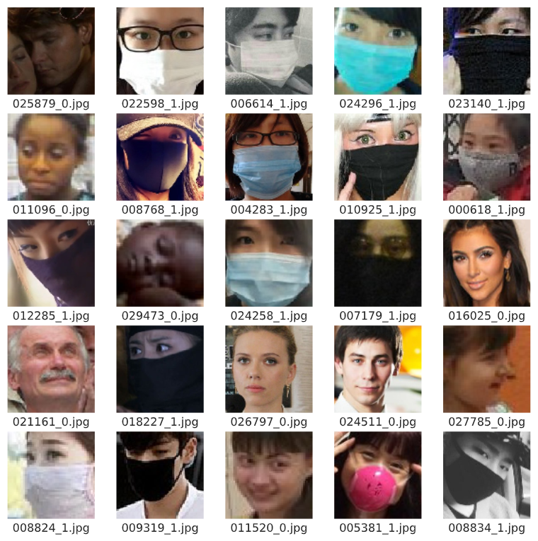
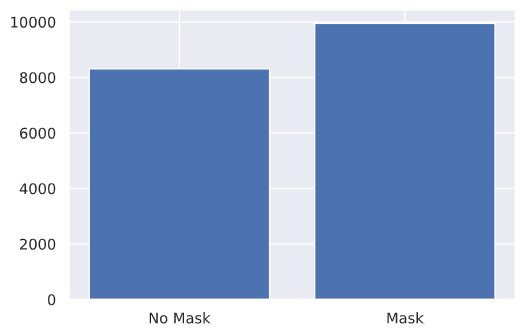
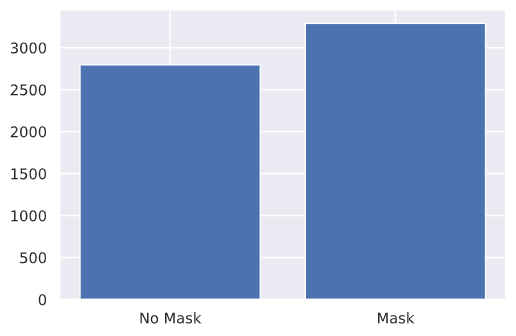
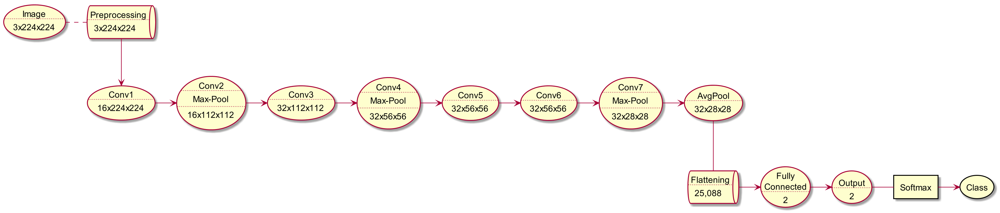
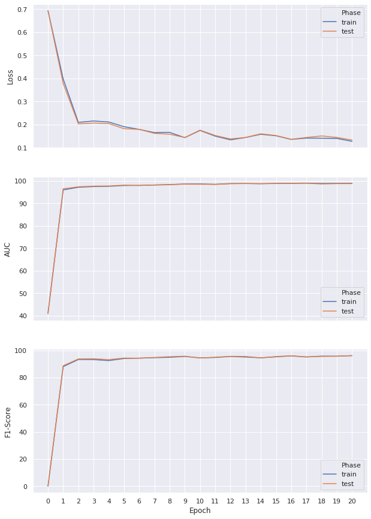
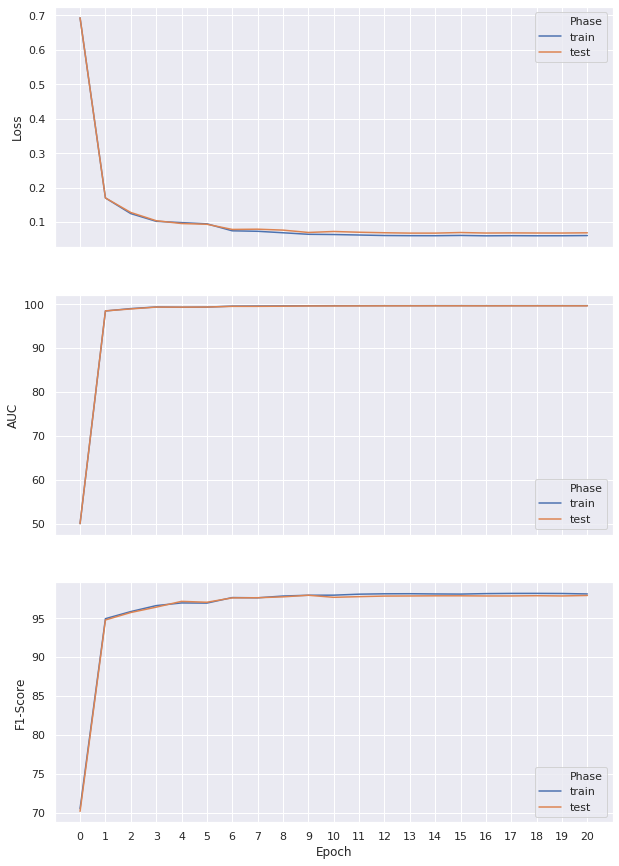

= COVID-19 Face Mask Recognition
:doctype: article
:encoding: utf-8
:lang: en
:!toc:
:!numbered:

[.text-right]
_Shahar Rotem - 206485898 +
Afik Bar - 311121289_

== Data
The dataset contains `24,345` facial image, splitted to train and test sets.

.Train Images sample

.Test Images sample

Both of the sets are balanced, as we can see from the following plots:

--
.Train Images Mask Ratio

.Test Images Mask Ratio

--

== Experiments

=== 7 Layers CNN
==== Preprocessing

To obtain better generalization, we've used several transformations:

- Random Cropping
- Random Horizontal Flipping
- Normalizing each color channel.

==== Model Architecture
Our neural network consists of 7 Convolutional layers with batch normalization & ReLU as activation function, 1 average pool, and 1 fully connected layers.

////
[uml,file="cnn_arch.png"]
--
queue Transform [
Preprocessing
....
3x224x224   
]

usecase Input [
Image
....
3x224x224
]

usecase Conv1 [
Conv1
....
16x224x224
]

usecase Conv2 [
Conv2
....
Max-Pool
....
16x112x112
]

usecase Conv3 [
Conv3
....
32x112x112
]

usecase Conv4 [
Conv4
....
Max-Pool
....
32x56x56
]

usecase Conv5 [
Conv5
....
32x56x56
]

usecase Conv6 [
Conv6
....
32x56x56
]

usecase Conv7 [
Conv7
....
Max-Pool
....
32x28x28
]

usecase AvgPool [
AvgPool
....
32x28x28
]

queue Flat [
Flattening
....
25,088 
]

usecase FC [
Fully
Connected
....
2
]

usecase Output [
Output
....
2
]

rectangle Softmax
storage Class

Input . Transform
Transform --> Conv1
Conv1 -> Conv2
Conv2 -> Conv3
Conv3 -> Conv4
Conv4 -> Conv5
Conv5 -> Conv6
Conv6 -> Conv7
Conv7 -> AvgPool
AvgPool -- Flat
Flat -> FC
FC -> Output
Output - Softmax
Softmax -> Class
--
////

.CNN Architecture

===== Loss Function
We've used Cross Entropy loss function.

===== Optimizer
We've tried several different optimizers, with different configurations, and found out that Adam-Weighted performed slightly better, with default decay & learning rate.

==== Regularization
We found out that Dropout consistently preformed worse (Possibly due to Batch normalization).

==== Convergence

We were able to reach a F1-Score of `96.1` on the test-set.

.7 Layers CNN Convergence

==== Conclusions
We found out that architecture changes had slight improvements over the data, and most of the improvements resulted from data augmentation.  

=== MobileNet

==== Preprocessing
To obtain better generalization, we've used several transformations:

- Random Cropping
- Random Horizontal Flipping
- Normalizing each color channel.

==== Model Architecture
We've used 
https://arxiv.org/pdf/1801.04381.pdf[MobileNet V2].

===== Loss Function
We've used Cross Entropy loss function.

===== Optimizer
We've used Adam-Weighted Optimizer, along with Learning Rate Scheduler.
Our initial learning rate was `0.001`, and scheduler gamma is `0.1`.

==== Regularization

==== Convergence
We were able to reach an accuracy of `97.95` on the test set.

.MobileNet Convergence

